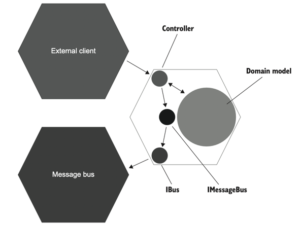

# 9장 목 처리에 대한 모범 사례

목은 테스트 대상 시스템과 의존성 간의 상호 작용을 모방하고 검사하는 데 도움이 되는 테스트 대역이다.  
목은 비관리 의존성(외부 애플리케이션에서 식별할 수 있음)에만 적용해야 한다.  
다른 것에 목을 사용하면 깨지기 쉬운 테스트가 된다.  

### 9.1 목의 가치를 극대화하기
예제 9.3 통합 테스트
```
var messageBusMock = new Mock<IMessageBus>();
var loggerMock = new Mock<IDomainLogger>(); 
... 
messageBusMock.Verify(
    x => x.SendEmailChangedMessage(
         user.UserId, "new@gmail.com"),
    Times.Once);
loggerMock.Verify(
    x => x.UserTypeHasChanged(
        user.UserId,
        UserType.Employee,
        UserType.Customer),
    Times.Once);
```
샘플 CRM 프로젝트에서 비관리 의존성인 IMessageBus와 IDomainLogger를 목으로 처리하였다.  

목을 사용할 떄는 시스템 끝에서 비관리 의존성과의 상호작용을 검증해야 한다.  
위 예제에서 messageBusMock의 문제점은 IMessageBus 인터페이스가 시스템 끝에 있지 않다는 것이다.  
IMessageBus는 IBus 위에 있는 래퍼로 도메인과 관련된 메시지를 정의한다.  
IMessageBus를 사용하면 이러한 모든 메시지를 한 곳에 보관하고 애플리케이션에서 재사용할 수 있다.  
IBus는 메시지 버스 SDK라이브러리 위에 있는 래퍼이다.  
IBus와 IMessageBus 인터페이스를 합칠 수 있지만 두 가지 책임(외부 라이브러리 복잡성을 숨기는 것과 모든 애플리케이션 메시지를 한 곳에 두는 것)은 분리돼 있는 것이 좋다.
 <br/>
위 그림은 육각형 아키텍처 관점에서 본 IBus와 IMessageBus의 위치다.  
IBus는 컨트롤러와 메시지 버스 사이의 타입 사슬에서 마지막 고리며 IMessageBus는 중간이다.  
IMessageBus 대신 IBus를 목으로 처리하면 회귀 방지를 극대화할 수 있다.  
비관리 의존성과 통신하는 마지막 타입을 목으로 처리하면 통합 테스가 거치는 클래스의 수가 증가하므로 보호가 향상된다.  
코드 베이스와의 결합도도 낮아지기 때문에 낮은 수준의 리팩터링에도 영향을 받지 않는다.  

**목을 스파이로 대테하기**  
스파이는 목과 같은 목적을 수행하는 테스트 대역이다.  
스파이는 수동으로 작성하고 목은 프레임워크의 도움을 받아 생성한다.  
스파이는 검증 단계에서 코드를 재사용해 테스트 크기를 줄이고 가독성을 향상시킨다.  
```
public void Changing_email_from_corporate_to_non_corporate()
{
    var busSpy = new BusSpy();
    var messageBus = new MessageBus(busSpy);
    var loggerMock = new Mock<IDomainLogger>();
    var sut = new UserController(db, messageBus, loggerMock.Object);
/* ... */
    busSpy.ShouldSendNumberOfMessages(1)
        .WithEmailChangedMessage(user.UserId, "new@gmail.com");
}
```
busSpy가 제공하는 인터페이스 덕분에 메시지 버스와의 상호작용을 검증하는 것이 간결해졌고 표현력도 생겼다.
```
messageBusMock.Verify(
    x => x.SendEmailChangedMessage(
        user.UserId, "new@gmail.com"),
    Times.Once);
```
이전 IMessageBus를 목으로 처리했던 이저과 비슷해졌다.  
이둘의 차이는 BusSpy는 테스트 코드에 MessageBus는 제품 코드에 속한다.  
테스트는 감시자로 메시지 구조가 변경되면 알 수 있지만 테스트에서 검증문을 작성할 때 제품 코드에 의존하면 안된다.  
IMessageBus를 목으로 처리하면 제풐 코드를 너무 신뢰하게 된다.  


### 9.2 목 처리에 대한 모범 사례
1. 목은 통함 테스트만을 위한 것  
도메인 모델에 대한 테스트는 단위 테스트 범주에 속하며, 컨트롤러를 다루는 테스트는 통합테스트다.  
목은 비관리 의존성에만 해당하며 컨트롤러만 이러한 의존성을 처리하는 코드이기 때문에 통합 테스트에서 컨트롤러를 테스트할 때만 목을 적용해야 한다.  


2. 테스트당 목이 하나일 필요는 없음  
동작 단위를 검증하는 데 필요한 목의 수는 관계가 없다.


3. 호출 횟수 검증하기   
비관리 의존성과의 통신에서는 다음 두가지를 확인해야 한다.  
예상하는 호출이 있는가? / 예상치 못한 호출은 없는 가?  
이 요구 사항은 다시 비관리 의존성과 하위 호환서을 지켜하는 데서 비롯된다.  
즉, 애플리케이션은 외부 시스템이 예상하는 메시지를 생략해서는 안 되며 예상치 못한 메시지도 생성해서는 안 된다.  


4. 보유 타입만 목으로 처리하기   
서드 파티 라이브러리 위에 항상 애탭터를 작성하고 기본 타입 대신 해당 어댑터를 목으로 처리해야 한다.
   - 서드파티 코드의 작동 방식에 대해 깊이 이해하지 못하는 경우가 많다.
   - 해당 코드가 이미 내장 인터페이스를 제공하더라도 목으로 처리한 동작이 실제로 외부 라이브러리와 일치하는지 확인해야 하므로, 해당 인터페이스를 목으로 처리하는 것은 위험하다.
   - 서드파티 코드의 기술 세부 사항까지는 꼭 필요하지 않기에 어댑터는 이를 추상화하고, 애플리케이션 관점에서 라이브러리와의 관계를 정의한다.   

   실제로 어댑터는 코드와 외부 환경 사이의 손상 방지 계층으로 작동한다.  
   어댑터를 통해 기본 라이브러리의 복잡성을 추상화하고 라이브러리에서 필요한 기능만을 노출하며 프로젝트 도메인 언어를 사용해 수행할 수 있다.  
   예제 샘플 CRM 프로젝트에서 IBus 인터페이스가 어댑터 역할을 했다. 기본 메시지 버스 라이브러리가 IBus 만큼 훌륭하고 깔끔한 인터페이스를 제공하더라도 고유의 래퍼를 그위에 두는 것이 좋다.  
