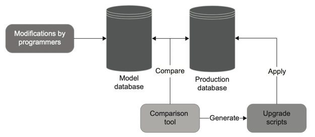

# 10장 데이터베이스 테스트

### 10.1 데이터베이스 테스트를 위한 전제 조건
테스트를 작성하기 전에 통합 테스트가 가능하게끔 준비 단계를 수행 해야 한다.
- 형상 관리 시스템에 데이터베이스 유지
- 모든 개발자를 위한 별도의 데이터베이스 인스턴스 사용
- 데이터베이스 배포에 마이그레이션 기반 방식 적용

#### 1. 데이터베이스를 형상 관리 시스템에 유지
데이터베이스를 테스트하는 방법의 첫 번째 단계는 데이터베이스 스키마를 일반 코드로 취급하는 것이다.  
일반 코드와 마찬가지로 데이터베이스 스키마는 Git과 같은 형상관리 시스템에 저장하는 것이 최선이다.  
 
전용 인스턴스를 모델 데이터베이스로 사용하는 것은 안티 패턴이다.    
이유는
- 변경 내역 부재 : 데이터베이스 스키마를 과거의 특정 시점으로 되돌릴 수 없다. 이는 운영 환경에서 버그를 재현할 때 중요할 수 있다.
- 복수의 원천정보 : 모델 데이터베이스는 개발 상태에 대한 원천 정보를 둘러싸고 경합하게 된다. 이렇게 기준을 두가지 두면 부담이 가중된다.

모든 데이터베이스 스키마 업데이트를 형상 관리 시스템에 두면 원천 정보를 하나로 할 수 도 있고  
일반 코드 변경과 함께 데이터베이스 변경을 추적할 수 있다.  

#### 2. 참조 데이터도 데이터베이스 스키마다
데이터베이스 스키마에 관한 유력한 용의자는 테이블, 뷰, 안덱스, 저장 프로시저 그리고 데이터베이스가 어떻게 구성되는지에 대한 청사진을 형성하는 나머지 모든것이다.  
참조데이터는 애플리케이션이 제대로 작동하도록 미리 채워야 하는 데이터이다.  
애플리케이션이 데이터를 수정할 수 있으면 일반데이터이고 그렇지 않으면 참조 데이터 이다.  
참조데이터는 애플리케이션의 필수 사항이므로 테이블, 뷰 그리고 다른 데이터베이스 스키마와 함께 SQL INSERT 문 형태로 형상 관리 시스템에 저장해야 한다.

### 3. 모든 개발자를 위한 별도의 데이터베이스 인스턴스
공유 데이터베이스를 사용하면 개발 프로세스를 방해하게 된다.  
서로 다른 개발자가 실행한 테스트는 서로 간섭되기 때문이고  
하위 호환성이 없는 변경으로 다른 개발자의 작업을 막을 수 있기 때문이다.  
테스트 실행 속도를 극대화하려면 개발자마다 별도의 데이터베이스 인스턴스를 사용하라.  

### 4. 상태 기반 데이터베이스 배포와 마이그레이션 기반 데이터 베이스 배포
데이터베이스 배포에는 상태 기반과 마이그레이션 기반이라는 두 가지 방식이 있다.  
마이그레이션 기반 방식은 초기에 구현하고 유지보수가 어렵지만 장기적으로 상태기반보다 더 효과적이다.  

**상태기반 방식**  
개발 내내 유지보수하는 모델 데이터베이스가 있으며
배포 중에 비교 도구가 스크립트를 생성해서 운영데이터베이스를 모델 데이터베이스와 비교해 최신상태로 유지한다.  
상태기반 방식을 사용하면 물리적인 모델 데이터베이스는 원천 데이터가 아니다.  
대신 데이터베이스를 작성하는데 사용할 수 있는 SQL 스크립트가 있다.
운영 데이터베이스의 상태와 상관없이   
비교 도구는 불필요한 테이블을 삭제하고 새 테이블을 생성하고 컬럼명을 바꾸는 등
모델 데이터베이스와 동기화하는데 필요한 모든 작업을 수행한다.  

**마이그레이션 기반 방식**  
데이터베이스를 어떤 버전에서 다른 버전으로 전환하는 명시적 마이그레이션을 의미한다.  
이 방식은 운영데이터베이스와 개발 데이터베이스를 자동으로 동기화하기 위한 도구를 쓸 수 없고  
업그레이드 스크립트를 직접 작성해야한다.  
이 방식에서 형상관리에 저장하는 산출물은 데이터베이스가 아닌 마이그레이션이다.  
마이그레이션은 일반적으로 평이한 SQL 스크립트(대표적으로 Flyway, Liquibase)로 표시하지만  
SQL로 변환할 수 있는 DSL 같은 언어를 사용해 작성할 수 있다.

**상대 기반 방식보다 마이그레이션 기반을 선호하라.**  

| |데이터베이스 상태|마이그레이션 메커니즘|
|----|----|----|
|상태 기반 방식|명시적|암묵적|  
|마이그레이션 기반 방식|암묵적|명시적|  

데이터베이스 상태가 명확하면 병합충돌을 처리하기 좋고  
명시적 마이그레이션은 데이터 모션문제를 해결하는데 도움이 된다.  
데이터 모션은 새로운 데이터베이스 스키마를 준수하도록 기존 데이터의 형태를 변경하는 과정이다.  
대부분의 프로젝트에서는 데이터 모션이 병합 충돌보다 훨씬 더 중요하기 때문에 마이그레이션 기반이 선호된다.  
예를 들어  
Name 컬럼을 FirstName과 LastName으로 나눌 때는 Name 컬럼을 삭제하고 FirstName과 LastName 컬럼을 만들어야 하며,  
기존의 모든 이름도 둘씩 나누는 스크립트를 작성해야하는데 상태 주도 방식을 사용하면 변경을 구현하기 쉽지 않다.

### 10.2 데이터베이스 트랜잭션관리
데이터베이스 트랜잭션 관리는 제품코드와 테스트코드 모두에 중유한 주제다.  
제품 코드에서 트랜잭션 관리를 적절히 하면 데이터 모순을 피할 수 있다.  

읽기 전용 연산에서는 여러 트랜잭션을 열어도 괜찮지만
데이터 변경이 포함된다면 모든 업데이트는 원자적이어야 한다.  

**데이터베이스 트랜잭션에서 데이터베이스 연결분리하기**  
잠재적인 모순을 피하려면 결정 유형을 두가지로 나눠야 한다.  
- 업데이트할 데이터
- 업데이트 유지 또는 롤백 여부

데이터베이스 클래스를 레포지터리와 트랜잭션으로 나눠서 이러한 책임을 분리할 수 있다.
- 레포지터리는 데이터베이스의 데이터와 데이터의 대한 접근과 수정을 가능하게 하는 클래스이다.   
샘플 프로젝트에는 User를 위한 리포지터리와 Company를 위한 리포지터리로 나누었다. 
- 트랜잭션은 데이터 업데이트를 완전히 커밋하거나 롤백하는 클래스이다.  
데이터 수정의 원자성을 확보하기 위해 기본 데이터베이스 트랜잭션에 의존하는 사용자 정의 클래스이다.

**통합 테스트에서 데이터베이스 트랜잭션 관리하기**  
테스트 구절간에 데이터베이스트랜잭션이나 작업 단위를 재사용하지 말라.   
운영환경과 동일하게 하기 위해 통합 테스트에서는 적어도 트랜잭션 또는 작업 단위를 사용해야 한다. (준비, 실행, 검증 구절당 하나씩)  

### 10.3 테스트 데이터 생명 주기
공유 데이터베이스를 사용하면 통합 테스트를 서로 분리할 수 없는 문제가 생긴다. 이 문제를 해결하려면,
- 통합 테스트를 순차적으로 실행하라.
- 테스트 실행 간에 남은 데이터를 제거하라.

#### 1. 병령 테스트 실행과 순차적 테스트 실행
통합 테스트를 제약 조건을 위반하지 않고 병렬로 실행하려면 상당한 노력이 필요하다.     
성능 향상을 위해 시간을 허비하지말고 순차적으로 통합 테스트를 실행하는 것이 실용적이다.  
대안으로 컨테이너(ex) 도커)를 사용해 테스트를 병렬처리 할 수 있지만 이는 유지보수 부담이 더 커지게 된다.  
통합테스트의 실행시간을 최소화해야 하는 경우가 아니라면 컨테이너는 사용하지 않는 것이 좋다.  

#### 2. 테스트 실행 간 데이터 정리
- 각 테스트 전에 데이터베이스 백업 복원하기
- 테스트 종료 시점에 데이터 정리하기
- 데이터베이스 트랜잭션에 각 테스트를 래핑하고 커밋하지 않기
- 테스트 시작 시점에 데이터 정리하기

#### 3. 인메모리 데이터베이스 피하기
인메모리 데이터베이스의 장점
- 테스트 데이터를 제거할 필요가 없음
- 작업 속도 향상
- 테스트가 실행될 때마다 인스턴스화 가능

이러한 장점에도 일반 테이터베이스와 기능적으로 일관성이 없고 운영환경과 테스트 환경이 일치 하지 않으므로 사용하지 않는 것이 좋다.  

### 10.4 테스트 구절에서 코드 재사용 하기
통합 테스트가 너무 빨리 커지면 유지 보수 지표가 나빠질 수 있다.  
통합 테스트는 가능한 짧게 하되 서로 결합하거나 가독성에 영향을 주지 않는 것이 중요하다.  
통합 테스트를 짧게 하기에 가장 좋은 방법은  
비즈니스와 관련이 없는 기술적인 부분을 비공개 메서드나 헬퍼 클래스로 추출하는 것이다. 이부분은 재사용할 수도 있기 때문이다.  

### 10.5 데이터베이스 테스트에 대한 일반적인 질문
### 1. 읽기 테스트를 해야하는가?
쓰기를 철저히 테스트하는 것은 매우 중요하지만 읽기는 아니다.  
읽기의 버그에는 해로운 문제가 없다. 가장 복잡하거나 중요한 읽기 작업만 테스트하면 된다.  

### 2. 레포지터리 테스트 해야 하는가?
레포지터리는 데이터베이스 위에 유용한 추상화를 제공한다.  
리포지터리는 직접 테스트 하지 말고 포괄적인 통합 테스트 스위트로 취급하라.  
리포지터리 테스트는 회귀 방지에 대한 이득이 너무 적은데 반해 유지비가 너무 높기 때문이다.  

Liquibase와 Flyway
참고: https://recordsoflife.tistory.com/867